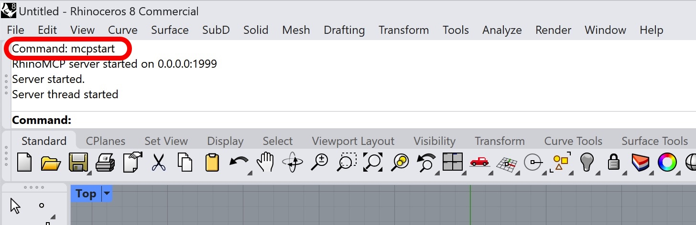
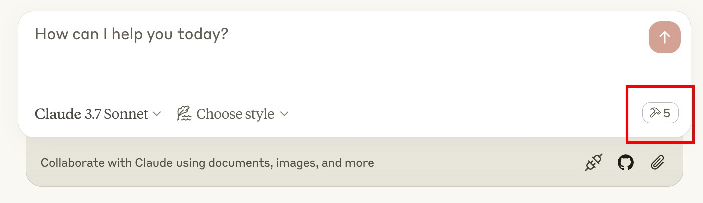
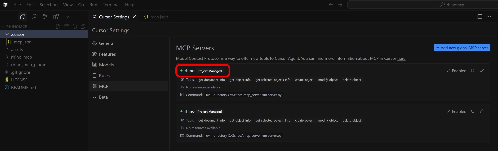
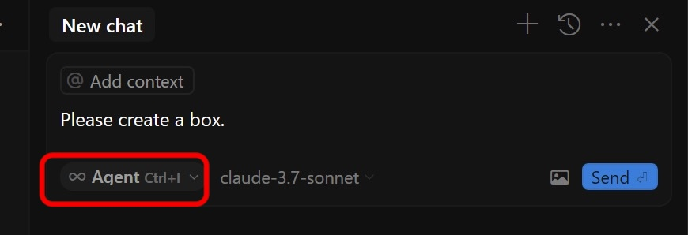

# RhinoMCP - Rhino Model Context Protocol Integration

RhinoMCP connects Rhino to Claude AI through the Model Context Protocol (MCP), allowing Claude to directly interact with and control Rhino. This integration enables prompt assisted 3D modeling in Rhino 3D.

## Demo

### Demo 1

This demo shows how to ask AI to create custom scripts and execute them in Rhino. Click the image below to watch the video.

[](https://youtu.be/NFOF_Pjp3qY)

### Demo 2

This demo shows how AI can interact with Rhino in two directions. Click the image below to watch the video.

[](https://youtu.be/pi6dbqUuhI4)

## Features

- **Two-way communication**: Connect Claude AI to Rhino through a socket-based server
- **Object manipulation**: Create, modify, and delete 3D objects in Rhino
- **Document inspection**: Get detailed information about the current Rhino document
- **Script execution**: Execute Rhinos python scripts in Rhino (experimental, may not work every time)
- **Object selection**: Select objects based on filters, e.g. name, color, category, etc. with "and" or "or" logic

> [!NOTE]  
> So far the tool only supports creating primitive objects for proof of concept. More geometries will be added in the future.
> Supported objects: Point, Line, Polyline, Curve, Box, Sphere

## Components

The system consists of two main components:

1. **MCP Server (`src/rhino_mcp_server/server.py`)**: A Python server that implements the Model Context Protocol and connects to the Rhino plugin
2. **Rhino Plugin (`src/rhino_mcp_plugin`)**: A Rhino plugin that creates a socket server within Rhino to receive and execute commands

## Installation

### Prerequisites

- Rhino 7 or newer (Works onWindows and Mac); make sure you Rhino is up to date.
- Python 3.10 or newer
- uv package manager

**⚠️ Only run one instance of the MCP server (either on Cursor or Claude Desktop), not both**

### Installing the Rhino Plugin

1. Go to Tools > Package Manager
2. Search for `rhinomcp`
3. Click `Install`

#### Install uv

**If you're on Mac, please install uv as**

```bash
brew install uv
```

**On Windows**

```bash
powershell -c "irm https://astral.sh/uv/install.ps1 | iex"
```

**⚠️ Do not proceed before installing UV**

### Config file

```json
{
  "mcpServers": {
    "rhino": {
      "command": "uvx",
      "args": ["rhinomcp"]
    }
  }
}
```

### Claude for Desktop Integration

Go to Claude > Settings > Developer > Edit Config > claude_desktop_config.json to include the above config file.

### Cursor integration

Make sure your cursor is up to date.

Create a folder `.cursor` in your project root.

Create a file `mcp.json` in the `.cursor` folder and include the above config file:

Go to Cursor Settings > MCP and check if it's enabled.

## Usage

### Starting the Connection



1. In Rhino, type `mcpstart` in the command line
2. Make sure the MCP server is running in the rhino terminal

### Using with Claude

Once the config file has been set on Claude, and the plugin is running on Rhino, you will see a hammer icon with tools for the RhinoMCP.



### Using with Cursor

Once the config file has been set on Cursor, and the plugin is running on Rhino, you will see the green indicator in front of the MCP server.



If not, try refresh the server in Cursor. If any console pops up, please do not close it.

Once it's ready, use `Ctrl+I` to open the chat box and start chatting with Rhino. Make sure you've selected **Agent** mode.



## Technical Details

### Communication Protocol

The system uses a simple JSON-based protocol over TCP sockets:

- **Commands** are sent as JSON objects with a `type` and optional `params`
- **Responses** are JSON objects with a `status` and `result` or `message`

## Limitations & Security Considerations

- The `get_document_info` only fetches max 30 objects, layers, material etc. to avoid huge dataset that overwhelms Claude.
- Complex operations might need to be broken down into smaller steps

## Building the tool and publishing

### Building and publishing the server

```bash
cd rhino_mcp_server
uv build
uv publish
```

### Building and publishing the plugin

1. build the tool in Release mode
2. copy the "manifest.yml" file to the "bin/Release" folder
3. run `yak build` in the Release folder
4. run `yak push rhino_mcp_plugin_xxxx.yak` to publish the plugin

## Contributing

Contributions are welcome! Please feel free to submit a Pull Request.

## Disclaimer

This is a third-party integration and not made by Mcneel. Made by [Jingcheng Chen](https://github.com/jingcheng-chen)
